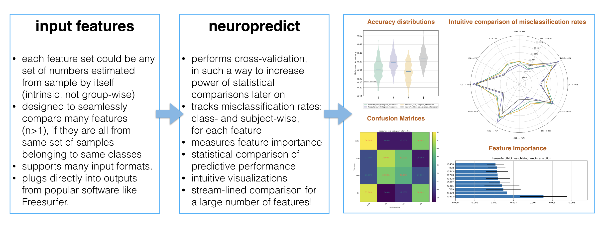
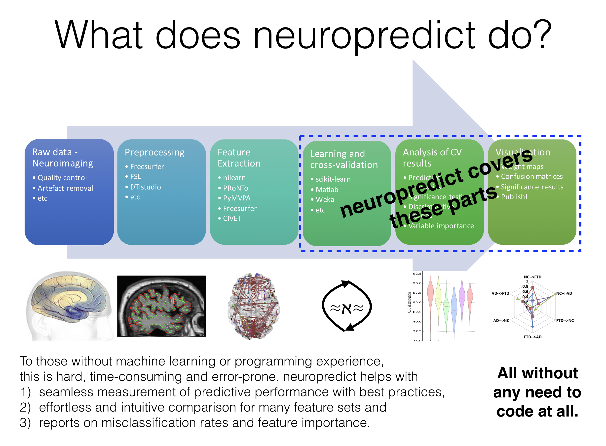

# neuropredict

[]

   
- Docs:   https://raamana.github.io/neuropredict/

## News

 - Good news: `neuropredict` can handle missing data now (that are encoded with `numpy.NaN`). This is done respecting the cross-validation splits without any data leakage.

## Overview

On a high level,

On a more detailed level,

 - Docs:   https://raamana.github.io/neuropredict/
 - Contributors welcome [here](CONTRIBUTING.md) with these [guidelines](http://contribution-guide-org.readthedocs.io). Thanks.

## Long term goals

neuropredict is part of a broader intiative to develop easy, comprehensice and standardized predictive analysis. See [here](https://drive.google.com/file/d/1A9vVgImZ4_Ud04wOE4n63atr8Uh4rR16/view?usp=sharing) for an overview and the bigger picture idea.

## Citation

If `neuropredict` helped you in your research in one way or another, please consider citing one or more of the following, which were essential building blocks of neuropredict:
 - Pradeep Reddy Raamana. (2017, November 18). neuropredict: easy machine learning and standardized predictive analysis of biomarkers (Version 0.4.5). Zenodo. http://doi.org/10.5281/zenodo.1058993
 - Raamana et al, (2017), Python class defining a machine learning dataset ensuring key-based correspondence and maintaining integrity, Journal of Open Source Software, 2(17), 382, doi:10.21105/joss.00382
 
## Change Log - version 0.5.2

 - Imputation of missing values
 - Additional classifiers such as `XGBoost`, Decision Trees
 - Better internal code structure
 - Lot more tests
 - More precise tests, as we vary number of classes wildly in test suites
 - several bug fixes and enhancements 
 - More cmd line options such as `--print_options` from a previous run
