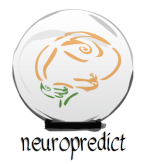
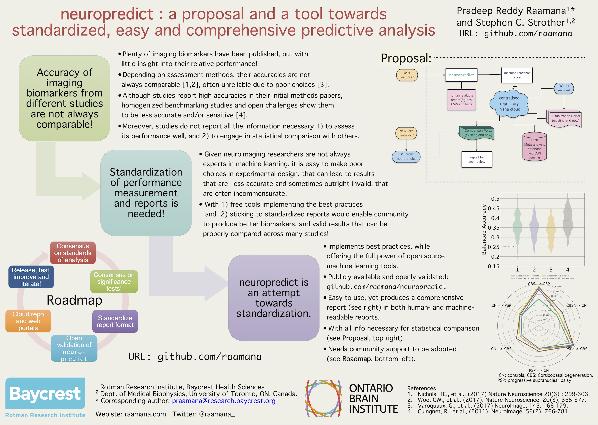

.. image:: https://landscape.io/github/raamana/neuropredict/master/landscape.svg?style=flat
    :target: https://landscape.io/github/raamana/neuropredict/master
.. image:: https://app.codacy.com/project/badge/Grade/3a209a18926a4856be68f9e54b3a7349
    :target: https://www.codacy.com/gh/raamana/neuropredict/dashboard?utm_source=github.com&amp;utm_medium=referral&amp;utm_content=raamana/neuropredict&amp;utm_campaign=Badge_Grade
.. image:: https://badge.fury.io/py/neuropredict.svg
    :target: https://badge.fury.io/py/neuropredict
.. image:: https://travis-ci.org/raamana/neuropredict.svg?branch=master
    :target: https://travis-ci.org/raamana/neuropredict
.. image:: https://img.shields.io/badge/python-3.6-blue.svg

.. image:: https://img.shields.io/badge/say-thanks-ff69b4.svg
    :target: https://saythanks.io/to/raamana

**Documentation**: https://raamana.github.io/neuropredict/

News
----

-  As of ``v0.6``, **neuropredict now supports regression applications**
   i.e. predicting continuous targets (in addition to categorical
   classes), as well as allow you to **regress out covariates /
   confounds** within the nested-CV (following all the best practices).
   Utilizing this feature requires the input datasets be specified in
   the ``pyradigm`` data structures: code @ https://github.com/raamana/pyradigm,
   docs @ https://raamana.github.io/pyradigm/. Check the changelog below for more details.

Older news
----------

-  ``neuropredict`` can handle missing data now (that are encoded with
   ``numpy.NaN``). This is done respecting the cross-validation splits
   without any data leakage.

Overview
--------

On a high level,

.. image:: docs/high_level_flow.png
   :alt: roleofneuropredict

On a more detailed level,

.. image:: docs/role.png
   :alt: roleofneuropredict

-  Docs: https://raamana.github.io/neuropredict/
-  Contributors most welcome: `check ideas <CONTRIBUTING.md>`__ and the following
   `guidelines <http://contribution-guide-org.readthedocs.io>`__.
   Thanks.

Long term goals
---------------

neuropredict, the tool, is part of a broader initiative described below
to develop easy, comprehensive and standardized predictive analysis:

Citation
--------

If ``neuropredict`` helped you in your research in one way or another,
please consider citing one or more of the following, which were
essential building blocks of neuropredict: 

 - Pradeep Reddy Raamana. (2017). neuropredict: easy machine learning and standardized predictive analysis of biomarkers (Version 0.4.5). Zenodo. http://doi.org/10.5281/zenodo.1058993 
 - Raamana et al, (2017), Python class defining a machine learning dataset ensuring key-based correspondence and maintaining integrity, Journal of Open Source Software, 2(17), 382, doi:10.21105/joss.00382

Change Log - version 0.6
--------------------------
- Major feature: Ability to predict continuous variables (regression)
- Major feature: Ability to handle confounds (regress them out, augmenting etc)
- Redesigned the internal structure for easier extensibility
- New ``CVResults`` class for easier management of a wealth of outputs generated in the Classification and Regression workflows
- API access is refreshed and easier

Change Log - version 0.5.2
--------------------------

-  Imputation of missing values
-  Additional classifiers such as ``XGBoost``, Decision Trees
-  Better internal code structure
-  Lot more tests
-  More precise tests, as we vary number of classes wildly in test
   suites
-  several bug fixes and enhancements
-  More cmd line options such as ``--print_options`` from a previous run

.. |travis| image:: https://travis-ci.org/raamana/neuropredict.svg?branch=master
   :target: https://travis-ci.org/raamana/neuropredict.svg?branch=master
.. |Code Health| image:: https://landscape.io/github/raamana/neuropredict/master/landscape.svg?style=flat
   :target: https://landscape.io/github/raamana/neuropredict/master
.. |Codacy Badge| image:: https://api.codacy.com/project/badge/Grade/501e560b8a424562a1b8f7cd2f3cadfe
   :target: https://www.codacy.com/app/raamana/neuropredict?utm_source=github.com&utm_medium=referral&utm_content=raamana/neuropredict&utm_campaign=Badge_Grade
.. |PyPI version| image:: https://badge.fury.io/py/neuropredict.svg
   :target: https://badge.fury.io/py/neuropredict
.. |Python versions| image:: https://img.shields.io/badge/python-3.5%2C%203.6-blue.svg
.. |saythanks| image:: https://img.shields.io/badge/say-thanks-ff69b4.svg
   :target: https://saythanks.io/to/raamana
