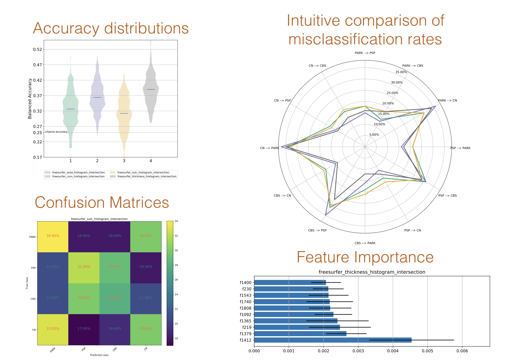

Examples
--------

If your features are collected into a ``features.csv`` file (each row is a subject, with features along the columns), running neuropredict is as simple as:

.. code-block:: bash

    neuropredict -m /project/meta_data.csv -d /project/features.csv

Where the ``meta_data.csv`` file specifies which subject belongs to which class. For example, if you have a dataset with the following three classes: 5 controls, 6 disease_one and 9 other_disease, all you would need to do is produce a meta data file as shown below (specifying a class label for each subject):

.. parsed-literal::

    3071,controls
    3069,controls
    3064,controls
    3063,controls
    3057,controls
    5004,disease_one
    5074,disease_one
    5077,disease_one
    5001,disease_one
    5002,disease_one
    5003,disease_one
    5000,other_disease
    5006,other_disease
    5013,other_disease
    5014,other_disease
    5016,other_disease
    5018,other_disease
    5019,other_disease
    5021,other_disease
    5022,other_disease

and `neuropredict` will produce the figures similar to the following:

The higher resolution PDFs are included in the `docs <docs/results_vis>`_ folder.

In addition to the figures, the data underlying the figures is also exported in the form of multiple separate ``CSV`` files to the ``exported_results`` folder under the chosen output directory.

You can choose values for many other parameters, and specify the features in few other formats. For examples, when using ``pyradigm`` as in the input format and choosing ``train_perc`` to be 75% and the repeating the CV 250 times, the typical output on the command line would look something like:

.. parsed-literal::

    neuropredict -y /project/*.MLDataset.pkl -m /project/meta_FourClasses.csv -o /project/predictions -t 0.75 -n 250

    Requested features for analysis:
    get_pyradigm from chebyshev.MLDataset.pkl
    get_pyradigm from chebyshev_neg.MLDataset.pkl
    get_pyradigm from chi_square.MLDataset.pkl
    get_pyradigm from correlate_1.MLDataset.pkl
    get_pyradigm from correlate.MLDataset.pkl
    get_pyradigm from cosine_1.MLDataset.pkl
    get_pyradigm from cosine_2.MLDataset.pkl
    get_pyradigm from cosine_alt.MLDataset.pkl
    get_pyradigm from cosine.MLDataset.pkl
    get_pyradigm from euclidean.MLDataset.pkl
    get_pyradigm from fidelity_based.MLDataset.pkl
    Different classes in the training set are stratified to match the smallest class!

     CV repetition   0
         feature   0      weight_chebyshev : balanced accuracy: 0.3018
         feature   1  weight_chebyshev_neg : balanced accuracy: 0.2917
         feature   2     weight_chi_square : balanced accuracy: 0.2603
         feature   3    weight_correlate_1 : balanced accuracy: 0.3271
         feature   4      weight_correlate : balanced accuracy: 0.3647
         feature   5       weight_cosine_1 : balanced accuracy: 0.3202
         feature   6       weight_cosine_2 : balanced accuracy: 0.2869
         feature   7     weight_cosine_alt : balanced accuracy: 0.3656
         feature   8         weight_cosine : balanced accuracy: 0.3197
         feature   9      weight_euclidean : balanced accuracy: 0.2579
         feature  10 weight_fidelity_based : balanced accuracy: 0.1190

     CV repetition   1
         feature   0      weight_chebyshev : balanced accuracy: 0.3416
         feature   1  weight_chebyshev_neg : balanced accuracy: 0.3761
         feature   2     weight_chi_square : balanced accuracy: 0.3748
         feature   3    weight_correlate_1 : balanced accuracy: 0.3397
         feature   4      weight_correlate : balanced accuracy: 0.4087
         feature   5       weight_cosine_1 : balanced accuracy: 0.3074
         feature   6       weight_cosine_2 : balanced accuracy: 0.4059
         feature   7     weight_cosine_alt : balanced accuracy: 0.3658
         feature   8         weight_cosine : balanced accuracy: 0.3290
         feature   9      weight_euclidean : balanced accuracy: 0.2662
         feature  10 weight_fidelity_based : balanced accuracy: 0.2090

     CV repetition   2
     . . . .
     . . . .
     . . . .
     CV repetition   n

.. note::

    pyradigm is a python class (data structure) aimed to ease your ML workflow - check it out here: `pyradigm.readthedocs.io <http://pyradigm.readthedocs.io>`_

