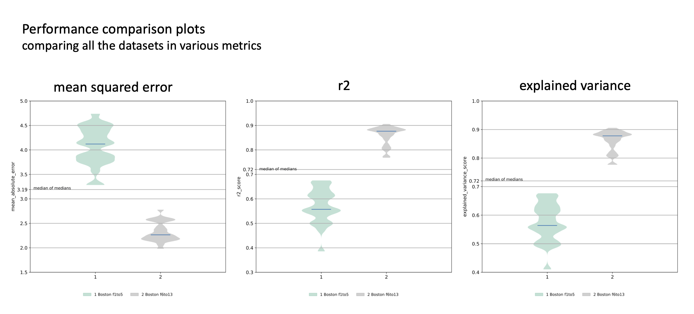

-----------------------------------
Results from Regression run
-----------------------------------

neuropredict produces a comprehensive report, parts of which can be seen in the figure below for a **regression** workflow:

.. image:: composite_outputs_regr_one.png
  :width: 700

The report consists of

 - distribtions of cross-validated performance, for each of dataset, as measured by r2, MAE, MSE and explained variance (if you need other metrics, open an `issue on github <https://github.com/raamana/neuropredict/issues/new>`_).
 - residual plots showing residuals as a function of original target value,
 - prediction plot showing the predicted target value as a function of original target value, and
 - few other diagnostic plots (such as subjects with high frequency of large residuals, an indication of them being an outlier) to be made available soon.

Each plots contains all the datasets included for comparison in the original neuropredict run.

Outputs and interpretation
---------------------------

The output directory (chosen with ``-o`` flag) contains the following sets of files, whose names are self-explanatory. In each set, there is separate visualization (PDF) or CSV file produced for each feature (named features A, B, C and D below) being studied, for your convenience.

**First**, a set of visualizations in PDF format:

.. parsed-literal ::

    compare_explained_variance_score.pdf
    compare_mean_absolute_error.pdf
    compare_mean_squared_error.pdf
    compare_r2_score.pdf
    predicted_vs_target.pdf
    residuals_vs_true_targets.pdf

**Second** *[TO BE PRODUCED]*, a set of CSV files in a subfolder called ``exported_results``, which can used for further posthoc statisical analysis or to produce more customised visualizations. The typical contents are shown below - note, filenames may change depending on your input file names.

.. parsed-literal ::

    explained_variance_score.csv
    mean_absolute_error.csv
    mean_squared_error.csv
    r2_score.csv

**Third**, a Python pickle file ``results_neuropredict.pkl`` containing the full set of results, that neuropredict bases the visualizations on. These are organized in a clear dictionary format with self-explanatory variable names, making it easy to reuse them for posthoc analyses in python and other places where ``pickle`` files can be read.

**Finally**, few miscellaneous set of files that neuropredict relies on to produce the comprehensive report.

We will walk you through the resulting visualizations one by one, and describe how to interpret them.

**INTERPRETATION TO BE ADDED/UPDATED.**

-------------

If something is unclear or confusing, or some documentation is missing, please open an `issue on github <https://github.com/raamana/neuropredict/issues/new>`_.

**These docs will be futher improved soon. Stay tuned!**

